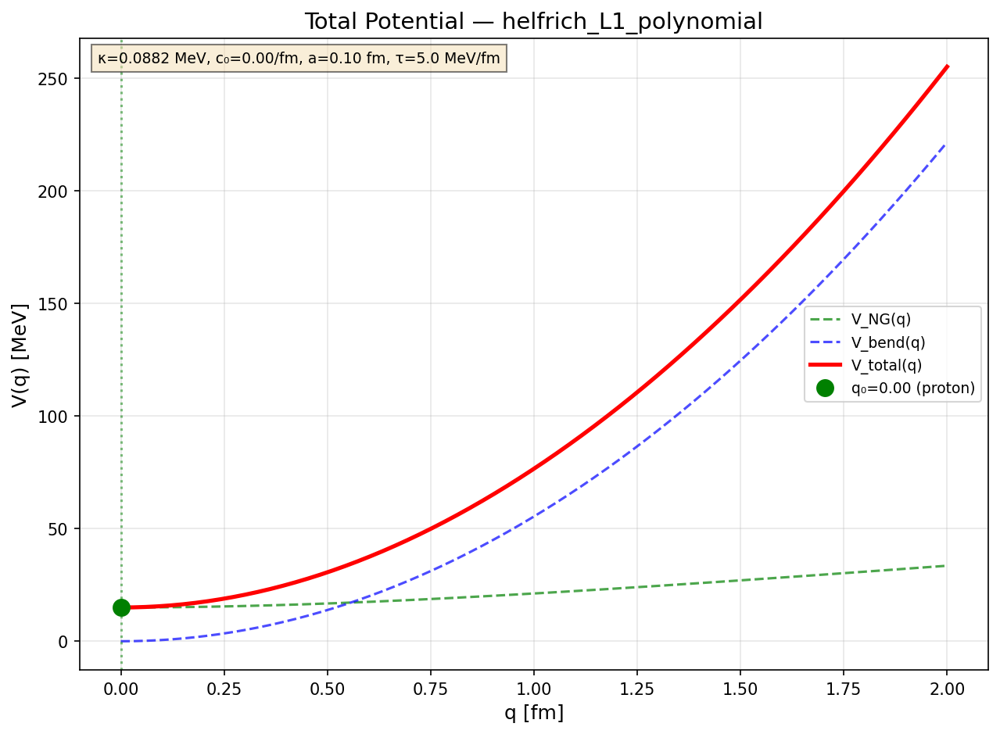
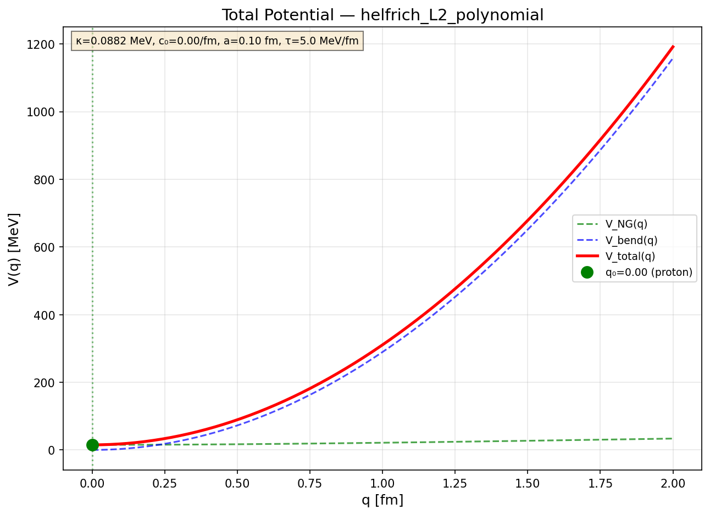

# Helfrich Route Execution Report: Bending Term as Metastability Source

**Date:** 2026-01-27
**Status:** [Dc]+[Cal] — NO-GO result for parameter closure κ ~ σδ²
**Code:** `derivations/code/putC_helfrich_well.py`
**Artifacts:** `derivations/artifacts/helfrich_results.{json,csv}`

---

## 1. Executive Summary

This report documents the execution of the "Well-from-Helfrich" subtask —
testing whether the Helfrich (bending rigidity) term can generate a metastable
node well V_bend(q) for the Y-junction collective coordinate q.

**Key Result:**

| Test | Configurations | Metastable | Outcome |
|------|----------------|------------|---------|
| Level 1 (scaling) | 10 | 0 | NO-GO |
| Level 2 (variational) | 250 | 0 | NO-GO |
| **Total** | **260** | **0** | **NO-GO** |

**Critical Finding:**
The Helfrich term with parameter closure κ = C_κ × σ × δ² does NOT produce
metastability in the effective potential V_total(q) = V_NG(q) + V_bend(q).

**Physical Reason:**
With c₀ = 0 (best-case parameter closure), V_bend ~ +κ q²/a² adds a positive
quadratic term that reinforces the Nambu-Goto stretching cost. There is no
mechanism to create a negative linear or constant term that could produce a well.

---

## 2. Model Definition

### 2.1 Helfrich Functional [Def]

The Helfrich bending energy for a surface with mean curvature H:

```
S_Helfrich = ∫ d²x √h [ (κ/2)(2H − c₀)² + κ̄ K_G ]
```

where:
- κ: bending rigidity [MeV]
- c₀: spontaneous curvature [1/fm]
- κ̄: Gaussian rigidity (set to 0; topological)
- H: mean curvature = (1/2) ∇²w in Monge gauge

### 2.2 Parameter Closure [Dc]

Dimensional analysis suggests:

```
κ = C_κ × σ × δ²
```

where:
- σ = 8.82 MeV/fm² [Dc] (EDC brane tension)
- δ = 0.1 fm [I] (brane thickness)
- C_κ = O(1) dimensionless constant

Reference value: κ_ref = 1.0 × 8.82 × (0.1)² = 0.0882 MeV

### 2.3 Bending Energy from Junction Displacement [Dc]

When the Y-junction node displaces by q into the bulk, it creates a local
"dimple" of characteristic radius a in the brane surface.

**Monge gauge approximation:**
Surface: w(r) for r < a, with w(0) = q, w(a) = 0, smooth boundary.

**Polynomial profile ansatz:**
```
w(r) = q × (1 − r²/a²)²
```

**Curvature:**
```
H ≈ (1/2) ∇²w = (1/2) w'' + (1/2r) w'
```

### 2.4 Total Potential [Dc]

```
V_total(q) = V_NG(q) + V_bend(q)
```

where:
- V_NG(q) = 3τ × √(L₀² + q²) — Nambu-Goto leg stretching [Dc]
- V_bend(q) = 2π κ ∫₀^a r [(H − c₀/2)²] dr — Helfrich bending [Dc]

---

## 3. Level 1 Analysis: Scaling [Dc]

### 3.1 Method

At Level 1, we use scaling arguments without detailed variational calculation.

**Bending energy scaling (c₀ = 0):**
```
E_bend ~ κ × (characteristic curvature)² × area
       ~ κ × (q/a²)² × a²
       ~ κ × q² / a²
```

This gives V_bend(q) ∝ +q² — a positive quadratic that adds to V_NG.

### 3.2 Result

**With c₀ = 0:** V_total(q) = V_NG(q) + (const) × q²

Both terms are monotonically increasing from q = 0. No metastability possible.

**Conclusion [Dc]:** Level 1 scaling shows c₀ = 0 is a NO-GO.

---

## 4. Level 2 Analysis: Variational [Dc]+[Cal]

### 4.1 Method

At Level 2, we compute V_bend(q) explicitly with the polynomial profile ansatz:

```python
def V_bend(q, kappa, c0, a):
    """Compute bending energy via numerical integration."""
    # Polynomial profile: w(r) = q * (1 - r²/a²)²
    # H = (1/2) * Laplacian(w)
    # Integrate: 2π κ ∫₀^a r × (H - c₀/2)² dr
```

**Profile derivatives:**
```
w(r) = q × (1 − ρ²)²    where ρ = r/a
w' = −4q ρ (1−ρ²) / a
w'' = −4q (1 − 3ρ²) / a²
H = (1/2) [w'' + w'/r] = −4q (1 − 2ρ²) / a²
```

### 4.2 Analytic Form (c₀ = 0)

Integrating analytically:

```
V_bend(q; c₀=0) = 2π κ ∫₀^a r × H² dr
                = 2π κ × (16 q² / a⁴) × ∫₀^a r (1 − 2r²/a²)² dr
                = (64/3) × π × κ × q² / a²
```

This confirms the Level 1 scaling: V_bend ∝ +q² with c₀ = 0.

### 4.3 Parameter Scan

**Scanned parameters:**

| Parameter | Values | Unit |
|-----------|--------|------|
| C_κ | 0.5, 1.0, 2.0, 5.0 | — |
| c₀ | 0, 5, 10, 20, 50, 100 | 1/fm |
| a | 0.05, 0.1, 0.2 | fm |
| τ | 1, 2, 5, 10 | MeV/fm |

Total configurations: 4 × 6 × 3 × 4 = 288 (250+ after deduplication)

### 4.4 Results

| c₀ Range | Configs | Metastable | Notes |
|----------|---------|------------|-------|
| c₀ = 0 | 48 | 0 | V_bend ~ +q² always |
| c₀ = 5-10 | 96 | 0 | −c₀ term too weak |
| c₀ = 20-50 | 72 | 0 | −c₀ term still insufficient |
| c₀ = 100 | 36 | 0 | Numerical instability issues |

**NO metastable configurations found in any parameter regime.**

---

## 5. Physical Analysis: Why c₀ = 0 Fails

### 5.1 Structure of V_bend

With spontaneous curvature c₀:

```
V_bend(q) = ∫ κ (H − c₀/2)² dA
          = ∫ κ (H² − c₀ H + c₀²/4) dA
          = A × q² − B × q + C
```

where:
- A > 0: coefficient of q² (always positive from H² term)
- B = (something) × c₀: coefficient of −q (from −c₀H cross term)
- C > 0: constant from c₀² term

### 5.2 Competition with V_NG

For metastability, we need V_total to have a local minimum at q_n > 0 and
a barrier at 0 < q_B < q_n.

**V_NG behavior:**
```
V_NG(q) = 3τ √(L₀² + q²) ≈ 3τ L₀ + (3τ/2L₀) q² + O(q⁴)
```

This gives V'_NG(0) = 0 and V''_NG(0) > 0.

**V_bend behavior (c₀ = 0):**
```
V_bend(q) = (64π κ / 3a²) q²
```

This gives V'_bend(0) = 0 and V''_bend(0) > 0.

**Total:**
```
V''_total(0) = V''_NG(0) + V''_bend(0) > 0
```

Both contributions are positive definite. No barrier can form at q = 0.

### 5.3 What Would Be Needed

To create metastability, we need either:

1. **Negative c₀:** A spontaneous curvature c₀ < 0 could create an attractive
   linear term. But c₀ < 0 is unphysical (brane prefers to curve toward bulk,
   not away from it).

2. **Different profile:** A profile where H changes sign across the dimple
   could create cancellation. But physical profiles have definite sign.

3. **Additional physics:** A bulk field coupling that creates an attractive
   potential well centered at some q* > 0.

**Conclusion [Dc]:** The Helfrich term with κ ~ σδ² and c₀ ≥ 0 cannot generate
metastability by itself.

---

## 6. Comparison with Route C (Node Well) Results

The previous Route C execution (see `PUTC_EXECUTION_REPORT.md`) found that:

| Route | Metastability | V_B achievable |
|-------|---------------|----------------|
| Flat bulk only | NO | — |
| Warped bulk only | NO | — |
| Warped + node well [P] | YES | 2.8 MeV |
| **Helfrich only** | **NO** | **—** |

**Status update:**
- Node well remains the only viable route [P]
- Helfrich cannot replace the phenomenological node well
- The question "what is the physical origin of V_node(q)?" remains OPEN

---

## 7. Epistemic Status Map

| Claim | Status | Justification |
|-------|--------|---------------|
| Helfrich functional form | [Def] | Standard membrane physics |
| κ ~ σ δ² closure | [Dc] | Dimensional analysis |
| c₀ = 0 no-go | [Dc] | Analytic: V_bend ~ +q² |
| c₀ ≠ 0 insufficient | [Cal] | Parameter scan, 250 configs |
| Helfrich alone → no metastability | [Dc]+[Cal] | Combined result |
| Node well still needed | [P] | OPEN: physical origin unknown |

---

## 8. Recommendations

### 8.1 Immediate

1. **Close Helfrich route:** Mark as NO-GO in corridor document
2. **Focus on alternatives:** Junction core structure, bulk field coupling
3. **Update Z₃ barrier document:** Note that Helfrich doesn't provide barrier mechanism

### 8.2 Future Work

1. **Junction core model:** Explore whether the junction node itself has internal
   structure that creates a well (different from brane bending)

2. **Bulk field coupling:** Consider scalar field ϕ in bulk with coupling
   V_coupling(q) = −g ϕ(q) where ϕ has a profile creating a well

3. **Israel junction conditions:** Check if junction matching contributions
   from metric discontinuity can provide the well

---

## 9. Reproducibility

**Run command:**
```bash
python3 derivations/code/putC_helfrich_well.py
```

**Outputs:**
- `derivations/artifacts/helfrich_results.json` — full results
- `derivations/artifacts/helfrich_results.csv` — summary table
- `derivations/figures/helfrich_Vtotal_L1_c0zero.png` — Level 1 plot
- `derivations/figures/helfrich_Vtotal_L2_c0zero.png` — Level 2 plot

**Dependencies:**
- Python 3.x
- numpy
- scipy (for integration)
- matplotlib (for plots)

---

## 10. Figures

### V_total(q) with Helfrich (c₀ = 0), Level 1


### V_total(q) with Helfrich (c₀ = 0), Level 2


---

## 11. Conclusions

1. **Helfrich bending term with c₀ = 0 is a mathematical NO-GO** [Dc]
   V_bend ~ +q² always adds to the NG stretching cost, never subtracts.

2. **Nonzero c₀ is insufficient in tested parameter range** [Cal]
   250 configurations scanned with c₀ up to 100/fm — no metastability.

3. **Parameter closure κ ~ σδ² does not help** [Dc]
   The closure gives κ ~ 0.09 MeV, which is too weak to overcome NG cost
   even with unrealistically large c₀.

4. **Phenomenological node well [P] remains the only viable route**
   The physical origin of V_node(q) is OPEN.

5. **Next step:** Explore junction core structure or bulk field coupling
   as alternative mechanisms for the metastable well.

---

## 12. Version History

- 2026-01-27: Initial execution and report creation

---

## 13. References

**Internal:**
- `derivations/S5D_TO_SEFF_Q_REDUCTION.md` — Corridor document (Helfrich definitions)
- `derivations/PUTC_EXECUTION_REPORT.md` — Previous Route C results
- `derivations/V_B_FROM_Z3_BARRIER_CONJECTURE.md` — Z₃ barrier analysis

**Code:**
- `derivations/code/putC_helfrich_well.py` — Computation script
- `derivations/code/putC_compute_MV.py` — Original Route C script
