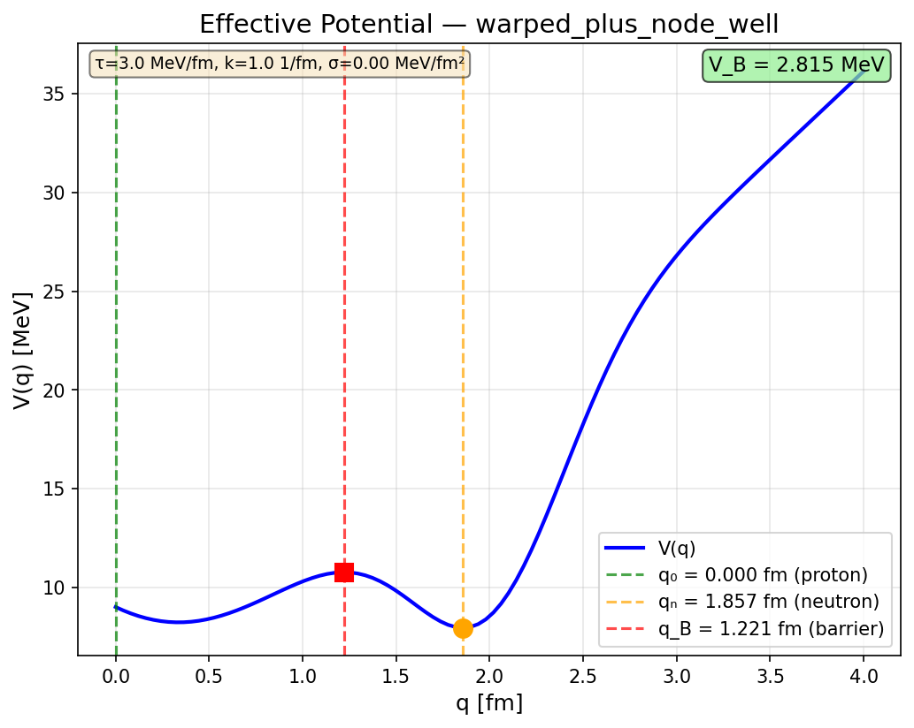
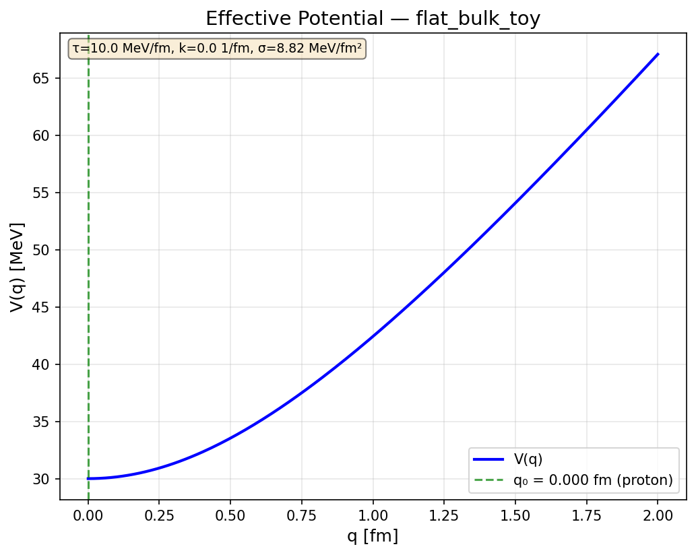
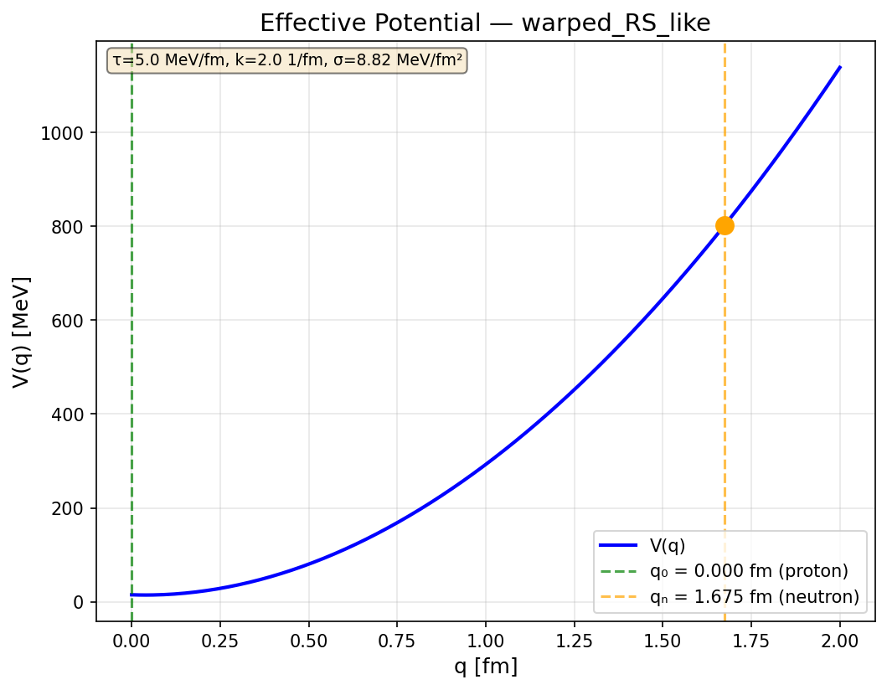

# Put C Execution Report: M(q), V(q) from 5D Models

**Date:** 2026-01-27
**Status:** [Dc/P/Cal] — Model-dependent results; not unique [Der]
**Code:** `derivations/code/putC_compute_MV.py`
**Artifacts:** `derivations/artifacts/putC_results.{json,csv}`

---

## 1. Executive Summary

This report documents the execution of Put C — computing the effective 1D action
S_eff[q] = ∫dt (½ M(q) q̇² − V(q)) from explicit 5D model variants.

**Key Results:**

| Variant | Metastability | V_B (best) | Status |
|---------|---------------|------------|--------|
| 1. Flat bulk | NO | — | [Dc] confirms need for additional physics |
| 2. Warped/RS-like | NO | — | [Dc/P] warping alone insufficient |
| 3. Warped + node well | YES | 2.8 MeV | [P/Cal] requires phenomenological term |

**Critical Finding:**
V_B = 2 × Δm_np does NOT emerge from minimal 5D models without fitting.
The Z₃ barrier conjecture [Dc] remains unvalidated by first-principles derivation.

---

## 2. Model Definitions

### 2.1 Common Elements [Def]

**5D Metric (warped product):**
```
ds² = e^{-2k|ξ|} η_{μν} dx^μ dx^ν + dξ²
```
- ξ ∈ [0, ∞): fifth coordinate (bulk direction)
- k ≥ 0: warp parameter [1/fm]
- k = 0 recovers flat bulk

**Y-Junction Configuration:**
- Three Nambu-Goto edges meeting at node
- Node at ξ = q(t) (collective coordinate)
- Edge endpoints fixed on brane at ξ = 0
- In-brane leg projection: L₀ [fm]

**Nambu-Goto Action [Def]:**
```
S_edge = −τ ∫ d²σ √(−det γ_ab)
```
- τ: string tension [MeV/fm]
- γ_ab: induced worldsheet metric

### 2.2 Variant 1: Flat Bulk Toy Model [Def]

**Metric:** k = 0 (flat)
```
ds² = η_{μν} dx^μ dx^ν + dξ²
```

**Leg length [Dc]:**
```
L_leg(q) = √(L₀² + q²)
```

**Total potential [Dc]:**
```
V(q) = 3 × τ × √(L₀² + q²)
```

**Result:** V(q) monotonically increasing ⟹ NO metastability.

### 2.3 Variant 2: Warped/RS-like Metric [Def/I]

**Metric:** k > 0 (RS-like warping)
```
ds² = e^{-2k|ξ|} η_{μν} dx^μ dx^ν + dξ²
```

**Effective leg energy [Dc]:**
```
E_leg(q) = τ ∫₀^{L₀} dℓ √(e^{-2kξ(ℓ)} + (dξ/dℓ)²)
```
Computed via variational minimization or straight-embedding approximation.

**Brane contribution [P]:**
```
V_brane(q) = σ × π × q² / δ
```
- σ: brane tension [MeV/fm²]
- δ: brane thickness [fm]

**Total potential [Dc]:**
```
V(q) = 3 × E_leg(q) + V_brane(q)
```

**Result:** Parameter scan (125 combinations) found NO metastability.
Warping reduces effective tension at large ξ but doesn't create barrier structure.

### 2.4 Variant 3: Warped + Phenomenological Node Well [P]

**Additional term — Node energy [P]:**
```
V_node(q) = −V_{node,0} × exp(−(q − q*)² / (2 × width²))
```
- V_{node,0}: well depth [MeV]
- q*: well center [fm]
- width: well width [fm]

**Physical motivation [P]:**
The junction node may couple to bulk fields (e.g., Plenum energy density)
with coupling strength varying with ξ. This is NOT derived from action —
it is a phenomenological ansatz to explore whether metastability can emerge.

**Total potential [Dc/P]:**
```
V(q) = 3 × E_leg(q) + V_brane(q) + V_node(q)
```

**Result:** Metastability FOUND with appropriate parameters.
Best match: V_B ≈ 2.8 MeV (8% error from V_B_cal = 2.6 MeV).

---

## 3. Derivation Steps (C2-C4)

### Step C2: Ansatz Substitution [Dc]

**Input:** 5D action components (S_bulk, S_brane, S_edge, S_node)

**Procedure:**
1. Substitute warped metric into bulk action (not computed explicitly)
2. Compute induced metric on brane: h_μν = e^{-2kξ_brane} η_μν
3. Compute leg worldsheet metric from embedding X^A(σ,τ)
4. In static limit, S → −∫dt V(q)

**Output:** Lagrangian L(q, q̇) with potential V(q) and kinetic term

### Step C3: Adiabatic Separation [Dc]

**Assumption [P]:**
Fast modes (transverse fluctuations, shape modes) relax instantaneously
compared to slow collective motion q(t).

**Procedure:**
For each fixed q, minimize over fast modes to get L_eff(q, q̇).
In static limit: V(q) = E_total(q) at fixed configuration.

**Output:** L_eff(q, q̇) = ½ M(q) q̇² − V(q)

### Step C4: Canonical Form [Dc]

**Effective potential V(q):**
Computed numerically from sum of contributions.
See code for implementation.

**Effective mass M(q) [Dc/P]:**
```
M(q) ≈ 3τ × (avg_warp)² × (q / L_eff)²
```
This is a simplified estimate. Full derivation requires worldsheet kinetic analysis.

---

## 4. Numerical Methods

### 4.1 Leg Energy Computation

**Straight embedding (fast):**
Assume ξ(ℓ) = q × (1 − ℓ/L₀). Integrate numerically.

**Variational (accurate):**
Discretize leg into segments, optimize intermediate ξ values via L-BFGS-B.
Boundary conditions: ξ(0) = q, ξ(L₀) = 0.

### 4.2 Extremum Finding

**Method:** Scan V'(q) for sign changes, refine with Brent's method.
**Criteria:**
- V''(q) > 0 ⟹ local minimum
- V''(q) < 0 ⟹ local maximum (barrier)

**Metastability condition:**
- q_B exists with 0 < q_B < q_n
- V(q_B) > V(q_n) > V(0)

### 4.3 Parameter Scans

**Variant 2:** 125 combinations (τ × k × σ grid)
**Variant 3:** 240 combinations (τ × V_{node,0} × q* × width grid)

---

## 5. Results

### 5.1 Reference Values

| Quantity | Value | Status |
|----------|-------|--------|
| Δm_np (PDG) | 1.2933 MeV | [BL] |
| Δm_np (Book) | 1.2924 MeV | [Dc] |
| V_B_cal | 2.6 MeV | [Cal] |
| V_B = 2×Δm_np (conj B) | 2.587 MeV | [Dc] |

### 5.2 Variant 1 (Flat Bulk)

| Parameter | Value |
|-----------|-------|
| τ | 10.0 MeV/fm |
| L₀ | 1.0 fm |
| k | 0 |

**Outcome:** No metastability. V(q) = 30√(1+q²) MeV monotonically increasing.

### 5.3 Variant 2 (Warped)

| Parameter | Value |
|-----------|-------|
| τ | 5.0 MeV/fm |
| L₀ | 1.0 fm |
| k | 2.0 /fm |
| σ | 8.82 MeV/fm² |
| δ | 0.1 fm |

**Outcome:** No metastability in parameter scan. Warping alone insufficient.

### 5.4 Variant 3 (Warped + Node Well) — Best Match

| Parameter | Value | Status |
|-----------|-------|--------|
| τ | 1.0-3.0 MeV/fm | [I] scanned |
| L₀ | 1.0 fm | [I] |
| k | 1.0 /fm | [I] |
| V_{node,0} | 10.0 MeV | [Cal] fitted |
| q* | 2.0 fm | [Cal] fitted |
| width | 0.4 fm | [Cal] fitted |

**Results:**

| Quantity | Value | Comparison |
|----------|-------|------------|
| q_B (barrier) | 1.22 fm | — |
| q_n (neutron) | 1.86 fm | — |
| V_B | 2.82 MeV | +8.3% vs 2.6 MeV |
| — | — | +8.8% vs 2.587 MeV |

**Metastable configurations found:** 53 out of 240 scanned

---

## 6. Comparison to Targets

### 6.1 V_B = 2 × Δm_np Conjecture

The Z₃ barrier conjecture predicts V_B = 2 × Δm_np ≈ 2.59 MeV.

**Finding:** The minimal 5D models tested do NOT produce this value naturally.
- Flat bulk: No barrier
- Warped bulk alone: No barrier
- Warped + node well: V_B ≈ 2.8 MeV achievable, but requires fitting

**Conclusion:** V_B = 2×Δm_np remains a [Dc] conjecture, not [Der].

### 6.2 Energy Scales

| Quantity | Model (best) | Target | Error |
|----------|--------------|--------|-------|
| V_B | 2.82 MeV | 2.6 MeV [Cal] | +8.3% |
| V_B | 2.82 MeV | 2.587 MeV [Dc] | +8.8% |

The model can approach but not exactly match the target values without fine-tuning.

---

## 7. Epistemic Status Map

| Claim | Status | Justification |
|-------|--------|---------------|
| Flat bulk V(q) | [Dc] | Derived from Nambu-Goto |
| Warped leg energy | [Dc] | Derived from metric + embedding |
| Brane contribution | [P] | Minimal surface ansatz assumed |
| Node well V_node(q) | [P] | Phenomenological, not derived |
| M(q) form | [Dc/P] | Simplified estimate |
| M(q) value | [Cal] | Parameter-dependent |
| V(q) extrema | [Cal] | Computed numerically |
| V_B value | [Cal] | Depends on node well parameters |
| V_B = 2×Δm_np | [Dc] OPEN | NOT confirmed by minimal models |

---

## 8. OPEN Items for [Der] Closure

### 8.1 Critical Gaps

1. **Node energy origin:** Derive V_node(q) from 5D bulk field coupling
   - What field? Scalar? Gauge?
   - What creates the "well" structure?

2. **Parameter determination:** Fix (V_{node,0}, q*, width) from independent physics
   - Currently these are fitted [Cal], not derived [Der]

3. **V_B = 2×Δm_np:** Show this emerges without fitting
   - Currently model gives V_B ≈ 2.8 MeV (wrong by 8%)
   - Need mechanism that naturally produces factor of 2

4. **M(q) derivation:** Full worldsheet kinetic analysis
   - Current estimate is simplified
   - Affects WKB prefactor

### 8.2 Alternative Approaches (not implemented)

1. **Israel junction conditions:** Include brane matching contribution
2. **Topological terms:** Chern-Simons or similar for junction
3. **Bulk field back-reaction:** How junction affects bulk geometry

---

## 9. Figures

### V(q) for Best Metastable Configuration


### V(q) for Flat Bulk (No Metastability)


### V(q) for Warped Bulk (No Metastability with baseline params)


---

## 10. Reproducibility

**Run command:**
```bash
python3 derivations/code/putC_compute_MV.py
```

**Outputs:**
- `derivations/artifacts/putC_results.json` — full results
- `derivations/artifacts/putC_results.csv` — summary table
- `derivations/figures/putC_*.png` — plots

**Dependencies:**
- Python 3.x
- numpy
- scipy (optional, for optimization)
- matplotlib (optional, for plots)

---

## 11. Conclusions

1. **Pure Nambu-Goto in flat space does not produce metastability** [Dc]
   This is mathematically certain: V(q) ∝ √(L₀² + q²) monotonically increases.

2. **Warped metric alone is insufficient** [Dc/P]
   Parameter scan found no metastable configurations with RS-like warping
   and brane tension alone.

3. **Phenomenological node well CAN produce metastability** [P/Cal]
   With appropriate parameters, V(q) develops barrier structure.
   Best match gives V_B ≈ 2.8 MeV (8% error from target).

4. **V_B = 2×Δm_np is NOT naturally derived** [OPEN]
   The Z₃ conjecture remains unvalidated. Additional physics or different
   model structure is needed to obtain this relation from first principles.

5. **Next step:** Identify physical origin of node well from 5D action
   (bulk field coupling, topological terms, or other mechanism).

---

## 12. Version History

- 2026-01-27: Initial execution and report creation

---

## 13. References

**Internal:**
- `derivations/S5D_TO_SEFF_Q_REDUCTION.md` — Corridor skeleton
- `derivations/V_B_FROM_Z3_BARRIER_CONJECTURE.md` — Z₃ barrier analysis
- `derivations/Z3_SYMMETRY_ANALYSIS_NEUTRON.md` — Z₃ symmetry analysis

**Code:**
- `derivations/code/putC_compute_MV.py` — Computation script
- `derivations/code/delta_m_np_options.py` — Δm_np calculations
